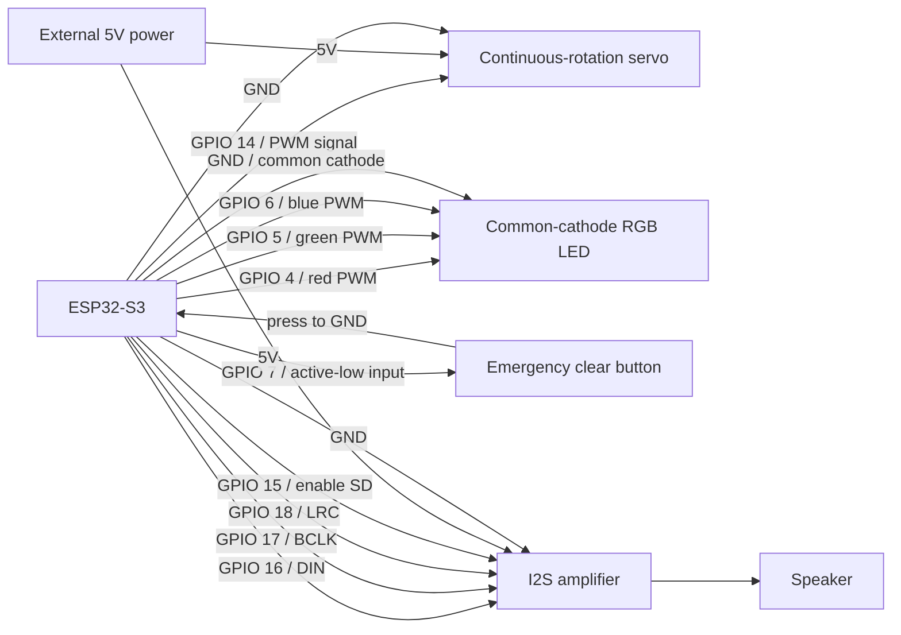

# Coder Buddy Wiring

This document summarizes the current ESP32-S3 wiring used by the firmware in `src/config.py`.

## Connection Diagram

## GPIO Map

| Function | Device Pin | Firmware Setting | Notes |
| --- | --- | --- | --- |
| Servo PWM | GPIO 14 | `SERVO_PIN` | Continuous-rotation servo signal. |
| RGB LED red | GPIO 4 | `RGB_R_PIN` | PWM output. |
| RGB LED green | GPIO 5 | `RGB_G_PIN` | PWM output. |
| RGB LED blue | GPIO 6 | `RGB_B_PIN` | PWM output. |
| Button OUT | GPIO 7 | `BUTTON_PIN` | Active-low input with pull-up enabled. |
| I2S DIN | GPIO 16 | `I2S_SD_PIN` | Audio data to amplifier. |
| I2S BCLK | GPIO 17 | `I2S_SCK_PIN` | I2S bit clock. |
| I2S LRC | GPIO 18 | `I2S_WS_PIN` | I2S word select / left-right clock. |
| Amp enable / SD | GPIO 15 | `AMP_ENABLE_PIN` | Active-high amplifier enable. |

## Power And Ground

- Tie all grounds together: ESP32-S3, servo power supply, RGB LED, button, and I2S amplifier.
- Use an external 5V supply for the servo if it draws more current than the ESP32 board can safely provide.
- The I2S amplifier may also need 5V depending on the module. Follow the amplifier module markings.
- Keep servo power wiring physically separate from signal wiring where possible to reduce noise.

## Behavior Notes

- Servo neutral is `SERVO_NEUTRAL_ANGLE = 90`. At boot and alert level 0, the firmware writes this neutral value so the continuous-rotation servo should stop.
- Active servo movement alternates between `SERVO_MIN_ANGLE = 80` and `SERVO_MAX_ANGLE = 100`.
- The RGB LED is configured as common cathode by default with `RGB_COMMON_CATHODE = True`.
- The button is the emergency clear action. Pressing it resets the alert level to 0 and stops servo movement, LED blinking, and audio playback.
